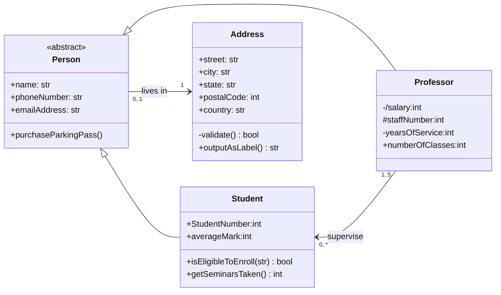
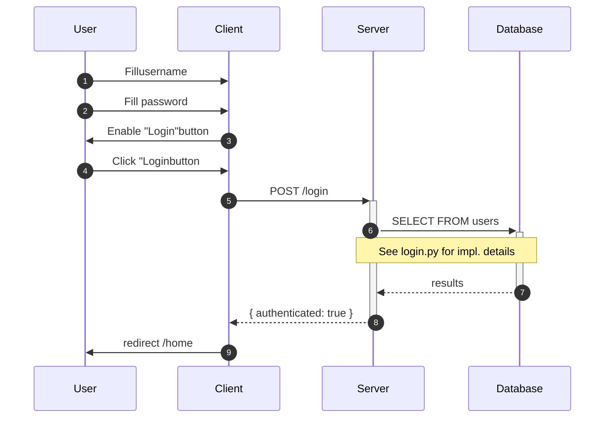
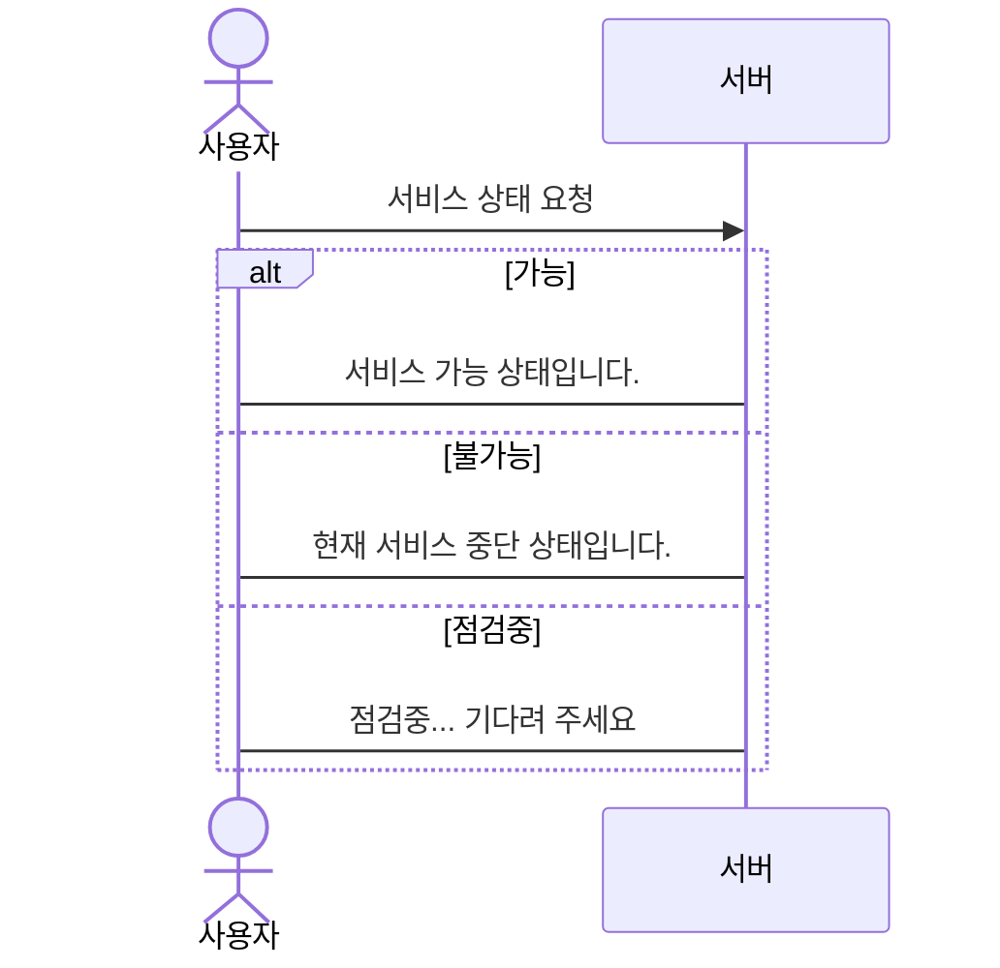
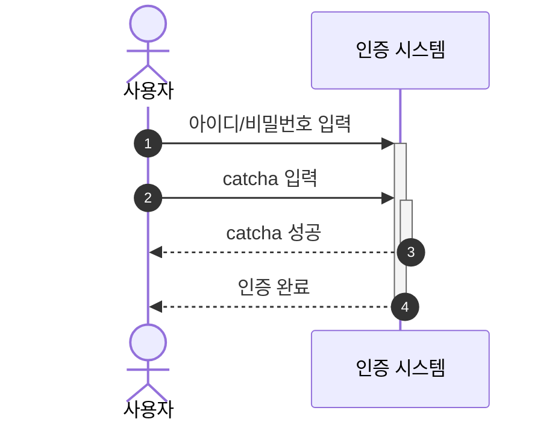
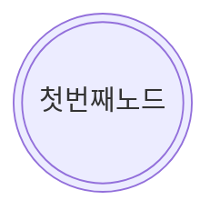
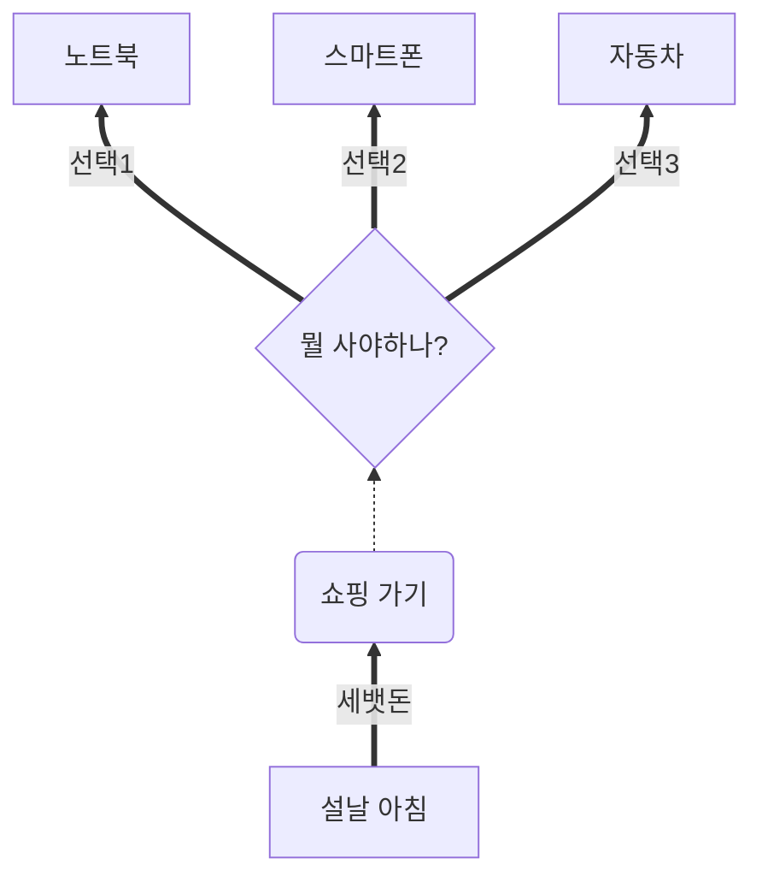

# Mermaid 실습
- 순서도 실습
    - 첫번째 샘플



<hr>
<hr>
<hr>



<hr>



<hr>



<hr>

```mermaid
flowchart TB %% 좌우 배치일 경우 `LR` 적용
    a([밥을 먹지 않았다])
    b{{String status = hunger <br> String = nothing}}
    c{배가 고픈가?}
    d{먹을 것이 있는가?}
    e[밥을 먹는다]
    f[밥을 먹었다]
    g([End])

    %% 연결선 작업
    a --> b --> c -->|YES| d -->|YES| e --> f --> g
    
    aa[배불러]
    c -->aa-->h
    h[안 먹는다]
    c -->|NO| h
    d --> |NO| h
    i[먹지 않는다]
    h --> i
    i --> g
```

<hr>






```Python
print('hello')
```

```Java
System.out.println("hello");
```
## 여기는 수업 끝
